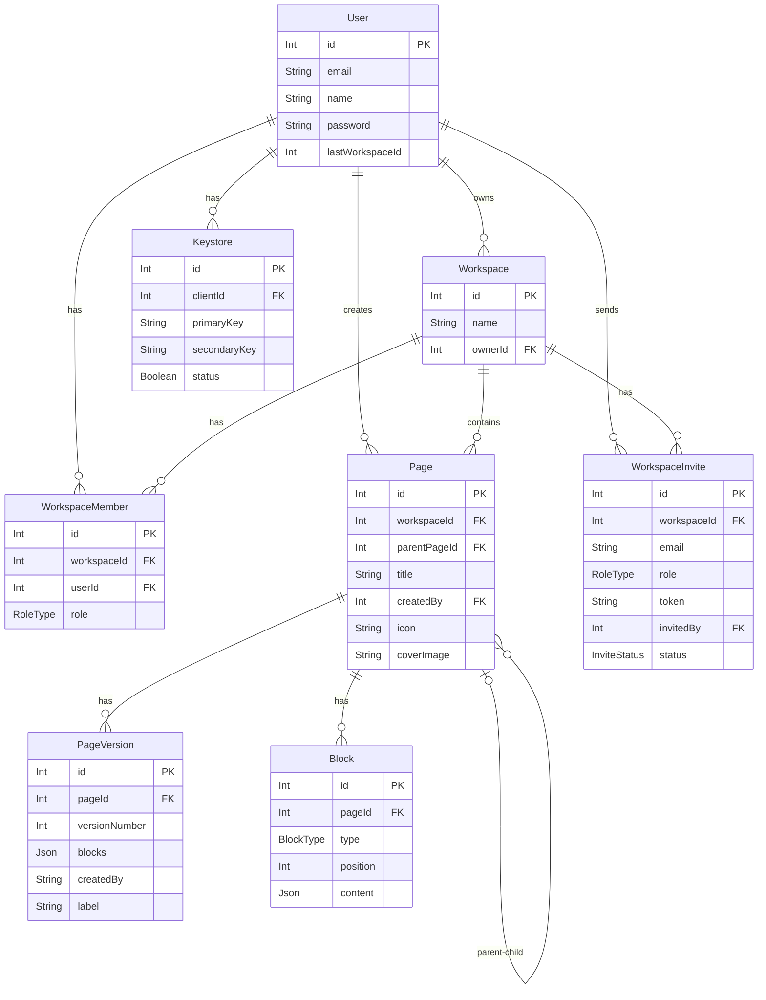

# Notion-like Collaborative Workspace (Backend-Focused)

This project is a backend-heavy implementation of a Notion-like workspace system. The primary goal was to design a secure, scalable, multi-tenant backend while keeping the frontend intentionally simple.

Rather than relying on managed backends or real-time databases, this project focuses on data modeling, authentication, authorization, and consistency guarantees — the parts that are hardest to get right.

> **MVP is complete and actively evolving.** Core features are live and working. The project is being improved iteratively.
---

## Tech Stack

**Backend** — Node.js, Express, Prisma ORM, PostgreSQL, `ws` (raw WebSockets), JWT

**Frontend** — React, TypeScript, NextJs

**Infra** — Frontend on Vercel, backend on Render, PostgreSQL hosted on Neon

---


## Overview

The application allows users to create and join workspaces, manage hierarchical pages, and edit content using block-based structures similar to Notion. Each workspace is treated as an isolated tenant, with strict authorization enforced at the API level. The system supports role-based access, secure authentication using refresh token rotation, real-time collaboration over WebSockets, multi-user presence with live cursors, and optimistic frontend updates synchronized with backend state.

---

## Demo Access

You can use the following test accounts to explore the live application:

**User 1**  
Email: `test@gmail.com`  
Password: `123456`

**User 2**  
Email: `najmakhatun0999@gmail.com`  
Password: `123456`

> Note: Email invitations are currently disabled in the live demo because the Resend account does not have a verified domain. To test collaboration, please log in using the two accounts above in separate browsers or incognito windows.

---


## Core Features

- Multi-tenant workspace architecture with role-based access control (Admin / Editor / Viewer)
- Hierarchical pages with parent–child relationships
- Block-based content system (paragraphs, headings, todos, code)
- **Page cover pictures and icons**
- **Real-time collaboration using WebSockets**
- **Multi-user presence and live cursors**
- Secure JWT authentication with refresh token rotation
- Optimistic UI updates with backend reconciliation
- Transaction-safe backend operations


---


## Architectural Decisions

### Why a Multi-Tenant Design?
Each workspace represents a separate tenant. This ensures clear data isolation between workspaces, allows users to belong to multiple workspaces with different roles, and keeps authorization logic explicit and enforceable at every API boundary. All pages, blocks, and permissions are scoped to a workspace to prevent cross-tenant data leakage.

### Authentication Strategy
Authentication uses JWT access tokens and refresh tokens instead of session-based auth. Access tokens are short-lived for API requests, while refresh tokens are stored using a keystore pattern and rotated on every refresh request. Tokens can be invalidated via keystore status rather than relying on expiry alone — preventing replay attacks and allowing revocation without affecting other sessions. Critical flows like token rotation are wrapped in database transactions for consistency.

### Why a Keystore Table?
Instead of storing refresh tokens directly on the user, each token is tied to a keystore entry. This allows tokens to be invalidated independently, makes rotation logic explicit and auditable, and lets compromised tokens be disabled without affecting other sessions.

### Real-Time Collaboration

WebSocket connections broadcast changes across connected clients within a workspace, enabling live editing, multi-user presence, and live cursors. The backend remains the source of truth, with real-time events layered on top of the existing REST architecture.

**How it works in practice:**

```
Alice and Bob open the same page
→ Alice types a block edit
→ Server saves to DB, then broadcasts the change
→ Bob sees the update instantly, no refresh needed
→ Alice's cursor position is visible to Bob in real time
→ If Alice opens a second tab, a separate cursor appears (tracked by tabId)
→ When Alice closes that tab, the cursor disappears — no ghost cursors
```


---

## Database Design

The schema is designed with explicit relationships and constraints. Pages support parent–child hierarchy through self-referencing relations, blocks are stored separately for flexible content rendering, and block content is stored as JSON to support multiple types without schema churn.

### Schema Diagram



---

## Block System Design

Blocks are modeled as independent entities instead of embedding content inside pages. This makes reordering and insertion straightforward, cleanly separates structure (page) from content (blocks), and lays the groundwork for drag-and-drop. Each block maintains a type, position, and JSON content payload.

---

## Backend Architecture

- Node.js with a layered, service-based structure
- Prisma ORM with PostgreSQL
- Centralized API response and error handling
- Transactions for critical write operations
- Explicit authorization checks per request
- WebSocket server for real-time event broadcasting

---

## What This Project Intentionally Avoids

No managed real-time backends (Convex, Firebase), no abstracted authentication providers, no premature optimizations. The point was to build and understand these systems from scratch.

---

## Design Decisions

Every non-trivial decision in this project involved a trade-off. Here's the thinking behind the key ones.

- **WebSocket vs Polling** — WebSocket keeps a persistent connection open so the server pushes changes instantly. Polling either hammers the server or feels laggy. We accepted the added complexity of managing connection lifecycle and room state because real-time collaboration without WebSocket isn't really real-time.

- **`ws` library vs Socket.io** — We chose raw `ws` over Socket.io so reconnection logic, room management, and message routing all had to be built manually. Slower to ship, but you can explain exactly what's happening under the hood — and that matters.

- **Optimistic UI for block edits** — The UI updates immediately and rolls back if the server rejects it. Waiting for server confirmation on every edit is safe but sluggish. Notion feels instant because it's optimistic.

- **Server saves to DB first, then broadcasts** — If the broadcast succeeds but the DB write fails, other clients would have data that doesn't actually exist. Saving first keeps the DB as the source of truth. Slightly higher latency, correctness is worth it.

- **TabId for cursor tracking instead of just userId** — One user with three tabs open = three cursors if you track by userId alone. `tabId` uniquely identifies each connection as `userId + tabId`. `user_left` only broadcasts when the last tab closes, no ghost cursors.

- **Role enforcement on both frontend and backend** — Backend-only is secure but bad UX. Frontend-only is no security at all. Both: frontend hides UI for viewers, backend rejects unauthorized requests. Logic lives in two places but there's no real alternative.

- **JWT over sessions** — JWTs are stateless, no DB lookup on every request, and work naturally with WebSocket auth. The trade-off is you can't instantly invalidate mid-expiry — mitigated by invalidating server-side on signout and clearing client tokens.

- **Email match on invite accept** — Without this, anyone who gets the invite link can join. Matching the logged-in user's email to the invite ensures invites are person-specific.

---

## What's Next

Right now the focus is on cleaning up the codebase and polishing what's already there. After that:

- Page versioning & history — append-only, so restoring v2 creates a new version rather than destroying anything in between. Snapshots will be debounced (30s inactivity) rather than captured on every keystroke. Schema foundation already in place via `PageVersion`.
- Drag-and-drop block reordering
- Conflict resolution for concurrent edits
- Soft deletes for pages and blocks

---

## Key Learnings

- Secure authentication requires careful state management
- Multi-tenant authorization must be enforced consistently at every layer
- Database transactions are critical for correctness, not just performance
- Backend systems often fail at edge cases, not happy paths
- Building from first principles leads to deeper understanding than using abstractions
- Real-time systems require thinking about state synchronization across clients, not just individual requests

---

## Status

**MVP complete — actively iterating.** The core workspace, collaboration, and content editing experience is functional and deployed. Focus now is on polish and consistency before the next round of features.

